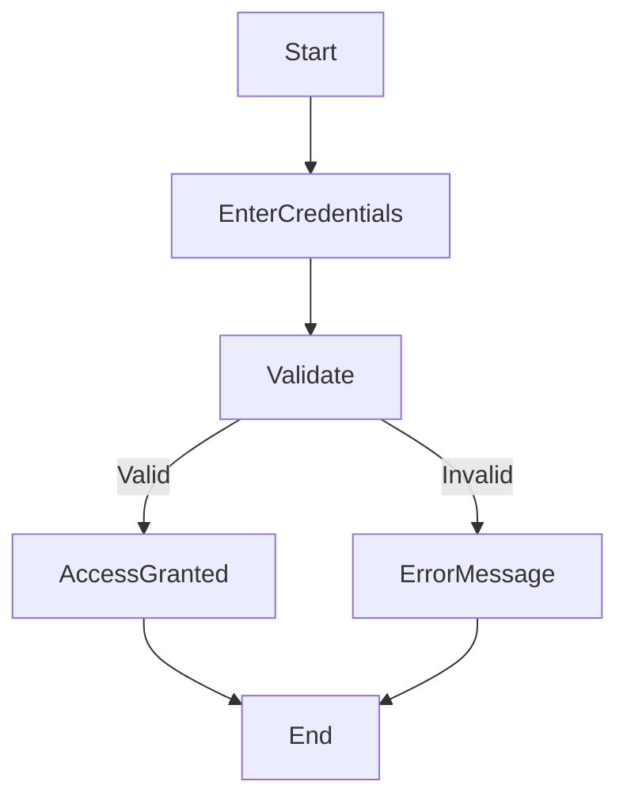
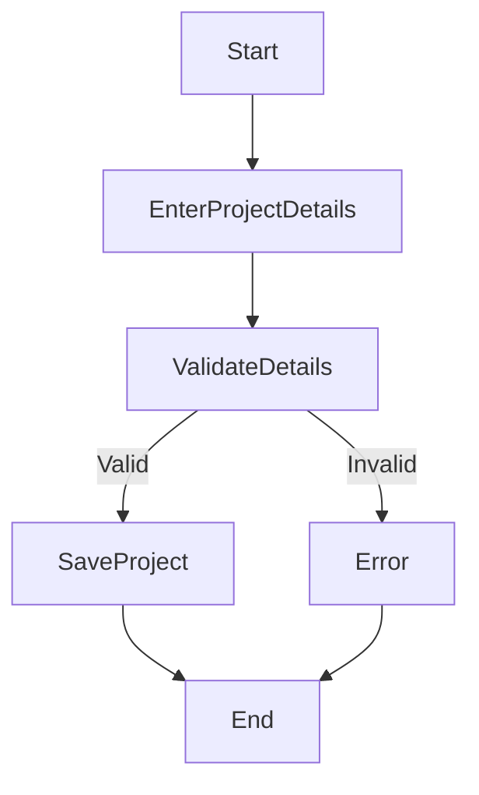
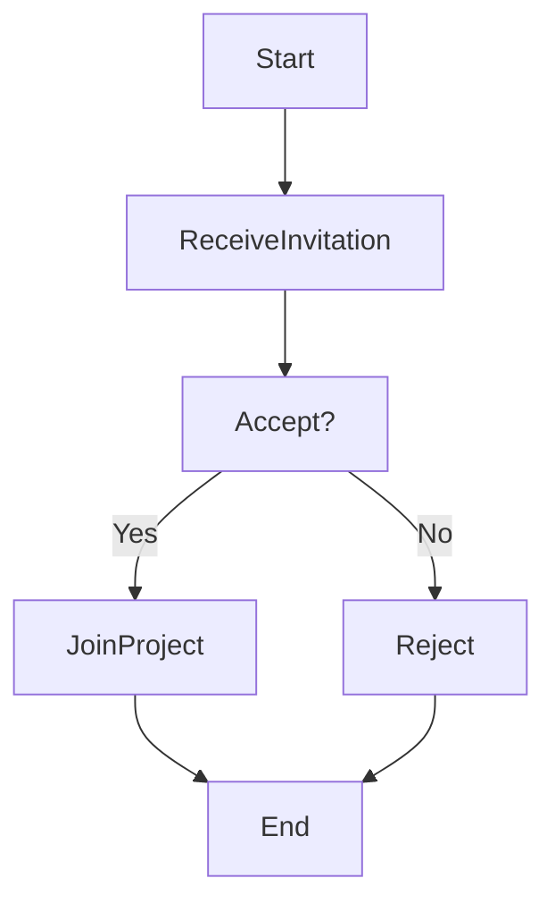
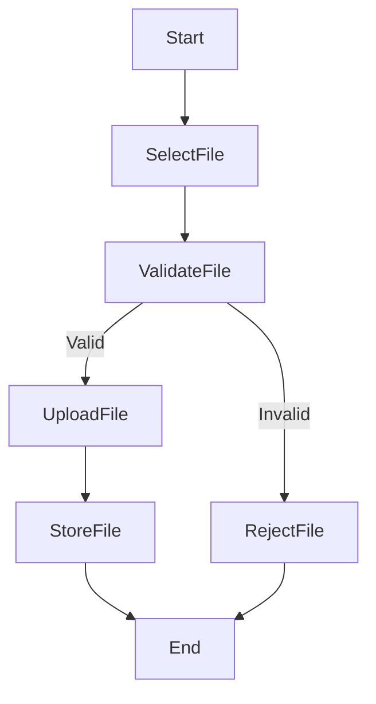
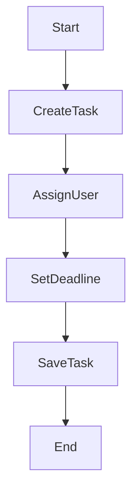
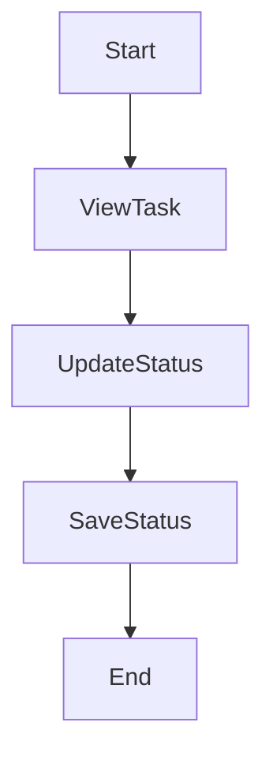
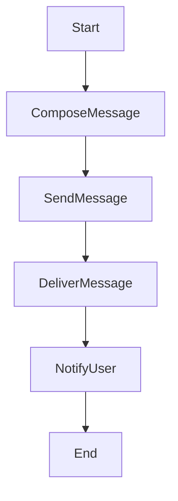
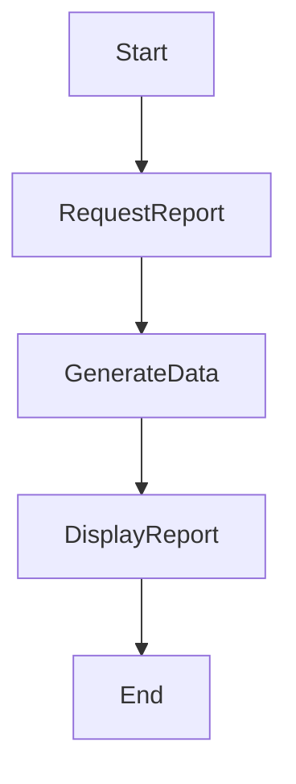

# Activity Workflow Modeling

## Introduction

This document models system workflows using UML activity diagrams. These diagrams represent processes, decision points, and interactions between system actors.

---

# 1. User Login Workflow

### Explanation

* Decision: Valid credentials
* Maps to:

  * FR1, US-001

---

# 2. Create Project Workflow

---

# 3. Join Project Workflow

---

# 4. Upload Document Workflow

---

# 5. Assign Task Workflow

---

# 6. Track Task Workflow

---

# 7. Messaging Workflow

### Parallel Logic:

* Deliver + Notify happen together

---

# 8. Generate Report Workflow

---

## Agile Alignment

Each workflow aligns with:

* User Stories (Assignment 6)
* Sprint tasks (Assignment 6)
* Kanban tracking (Assignment 7)

This ensures continuity between design and Agile execution.
