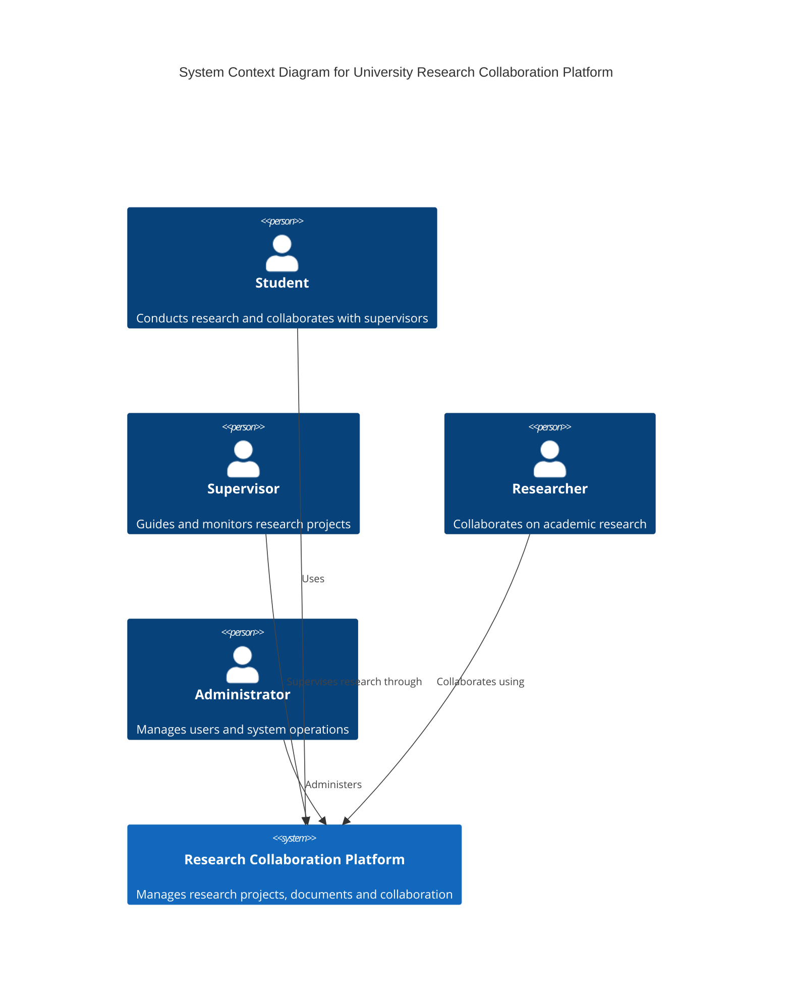
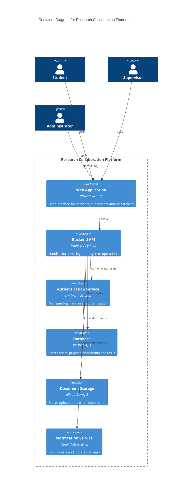
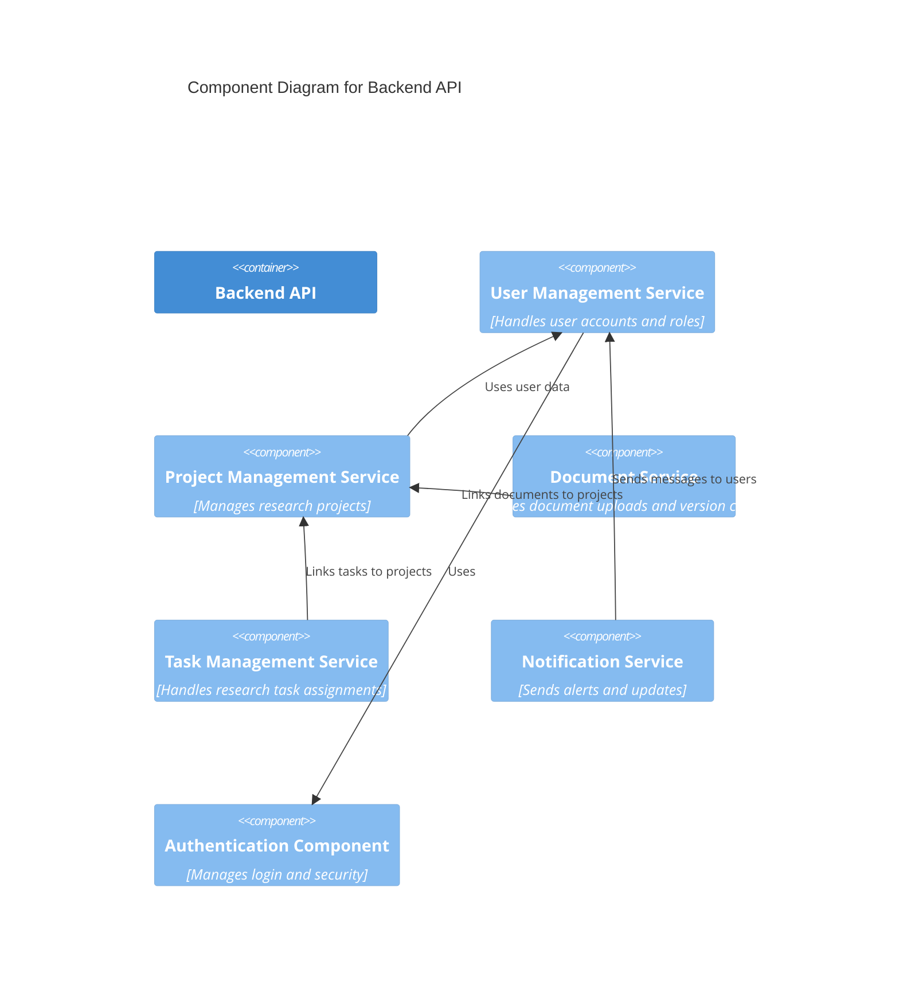

# System Architecture

## Project Title

University Research Collaboration Platform

## Domain

Education / Academic Research Management

## Problem Statement

Universities require a centralized system that enables efficient collaboration between students, supervisors, and researchers during research projects. Without a structured platform, research teams rely on multiple disconnected tools for communication, document sharing, and task management. This fragmentation leads to inefficiencies and reduced research productivity.

The University Research Collaboration Platform provides a unified system where research teams can manage projects, share documents, assign tasks, and communicate effectively.

## Individual Scope

This project focuses on the architectural design of the system using the C4 model to illustrate how the system components interact and how the platform supports research collaboration workflows.

---

# C4 Architecture Model

The architecture of the system is modeled using the C4 model which includes the following levels:

1. System Context Diagram
2. Container Diagram
3. Component Diagram

---

# System Context Diagram

---

# Container Diagram

---

# Component Diagram

