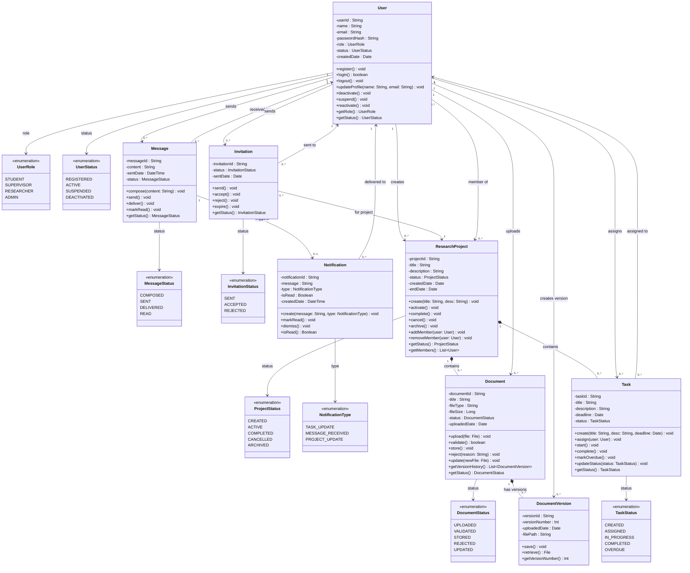

# Class Diagram – University Research Collaboration Platform

## Introduction

This document presents a comprehensive UML class diagram for the University Research Collaboration Platform using Mermaid.js syntax. It builds upon the domain model, functional requirements (Assignment 4), use cases (Assignment 5), user stories (Assignment 6), and state/activity diagrams (Assignment 8) to produce a complete object-oriented design of the system.

---

## Class Diagram

---

## Key Design Decisions

### 1. Separation of User Roles via Enumeration
Rather than creating separate subclasses (`Student`, `Supervisor`, `Researcher`, `Admin`), a single `User` class with a `UserRole` enumeration was chosen. This avoids deep inheritance hierarchies and keeps the model flexible — a user's role can change without requiring a new object. This aligns with the RBAC (Role-Based Access Control) requirement from FR2 and reflects real-world identity management patterns.

### 2. Composition for Document Versioning
`DocumentVersion` is modelled as a composition within `Document`. This means a version cannot exist independently of its parent document. This design correctly captures the business rule that every document upload or update creates a traceable version record, directly supporting FR6 (Version Control).

### 3. Composition for Documents and Tasks Within Projects
Both `Document` and `Task` are composed within `ResearchProject`. Deleting or archiving a project logically makes its documents and tasks inaccessible, which reflects the business rule that archived projects are read-only.

### 4. Invitation as an Explicit Class
Instead of a direct many-to-many association between `User` and `ResearchProject`, an explicit `Invitation` class models the join process. This preserves invitation status, creation date, and lifecycle (Sent → Accepted/Rejected), satisfying FR4 (Join Project) and UC7 (Join Project use case).

### 5. Notification Decoupled from Message
`Notification` is a separate class linked to `Message` via a `triggers` association. This allows the notification system to be extended in future — for example, task deadline alerts or project status changes — without modifying the `Message` class. This aligns with the notification service identified in the Container Diagram (Assignment 3).

### 6. Enumerations for All State Fields
Every status field across entities is typed to a dedicated enumeration. This enforces valid state transitions at the type level and directly mirrors the state diagrams from Assignment 8, ensuring the class diagram and behavioural models are consistent.

### 7. Alignment With Use Cases and User Stories
Every class and key method maps to at least one use case (Assignment 5) and user story (Assignment 6):

| **Class / Method** | **Use Case** | **User Story** |
|---|---|---|
| `User.login()` | UC1: Login | US-001 |
| `ResearchProject.create()` | UC6: Create Project | US-002 |
| `Invitation.accept()` | UC7: Join Project | US-003 |
| `Document.upload()` / `validate()` | UC2: Upload Document | US-004 |
| `Task.assign()` | UC3: Assign Tasks | US-005 |
| `Task.updateStatus()` | UC4: Track Tasks | US-006 |
| `Message.send()` | UC5: Send Messages | US-007 |
| `User.deactivate()` / `reactivate()` | UC8: Manage Users | US-008 |
