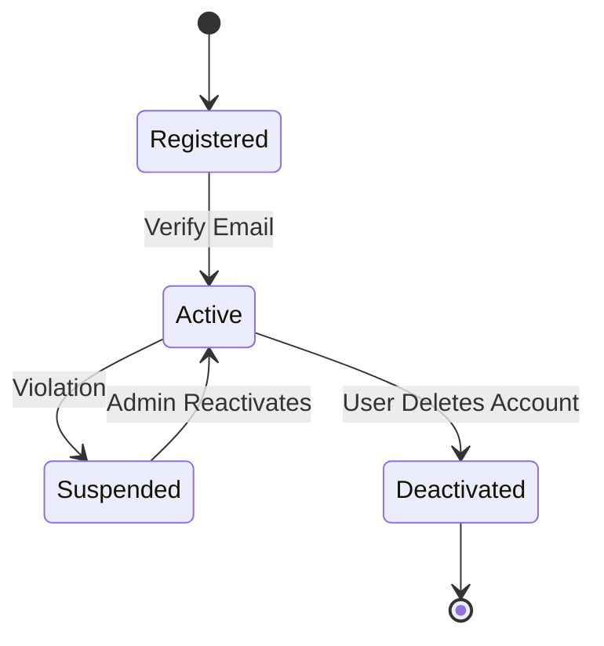
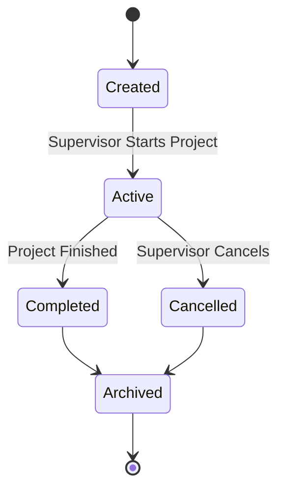
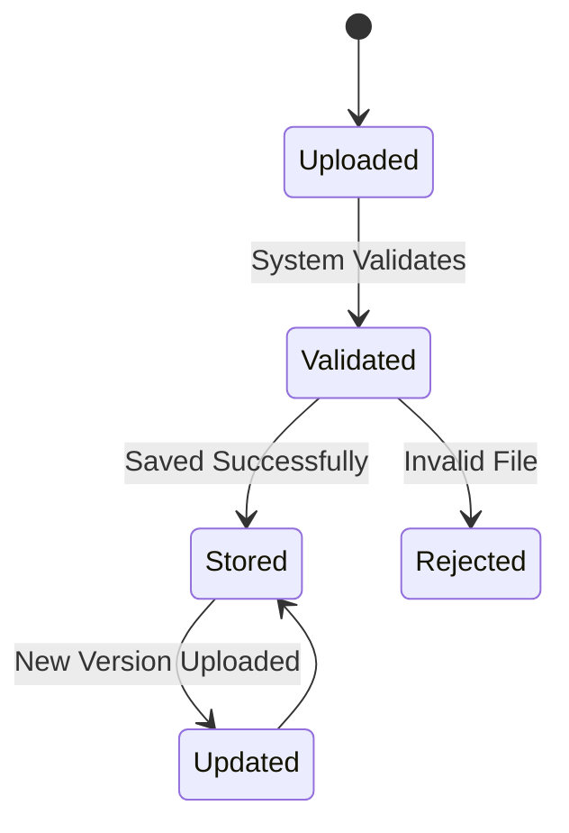
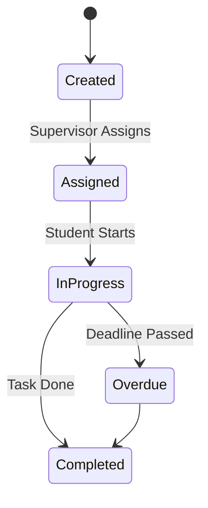
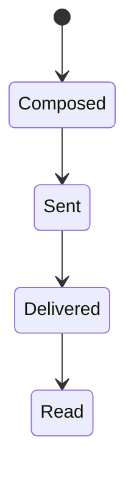
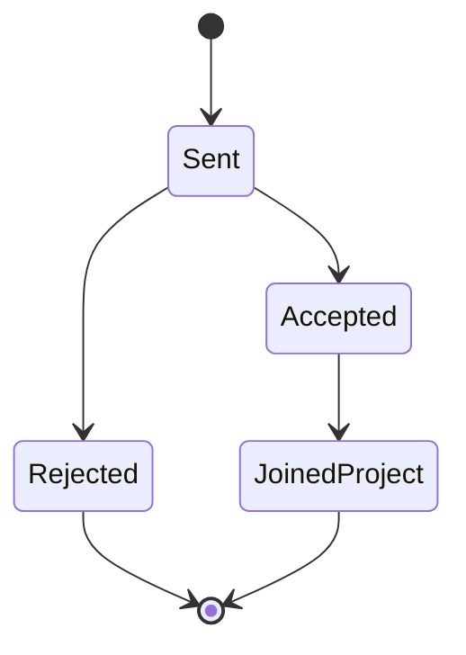
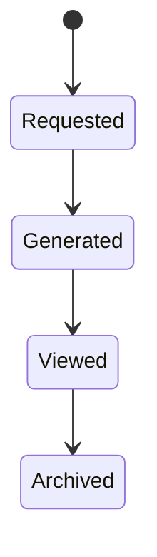

# Object State Modeling

## Introduction

This document models the lifecycle of key system objects using UML state transition diagrams. These diagrams illustrate how objects change states in response to events and align with system requirements and use cases.

---

# 1. User Account State Diagram

### Explanation

* **States:** Registered, Active, Suspended, Deactivated
* **Key Transition:** Email verification activates account
* **Mapping:**

  * FR1: User Login
  * US-001: Login functionality

---

# 2. Research Project State Diagram

### Explanation

* Reflects project lifecycle
* Maps to:

  * FR3: Create Project
  * US-002

---

# 3. Document State Diagram

### Explanation

* Includes validation (important for backend logic)
* Maps to:

  * FR5: Upload Document
  * US-004

---

# 4. Task State Diagram

### Explanation

* Shows task tracking lifecycle
* Maps to:

  * FR7, FR8
  * US-005, US-006

---

# 5. Message State Diagram

### Explanation

* Messaging workflow
* Maps to:

  * FR9
  * US-007

---

# 6. User Invitation State Diagram

### Explanation

* Handles joining projects
* Maps to:

  * FR4
  * US-003

---

# 7. Report State Diagram

### Explanation

* Reporting lifecycle
* Maps to:

  * FR10
  * US-009
