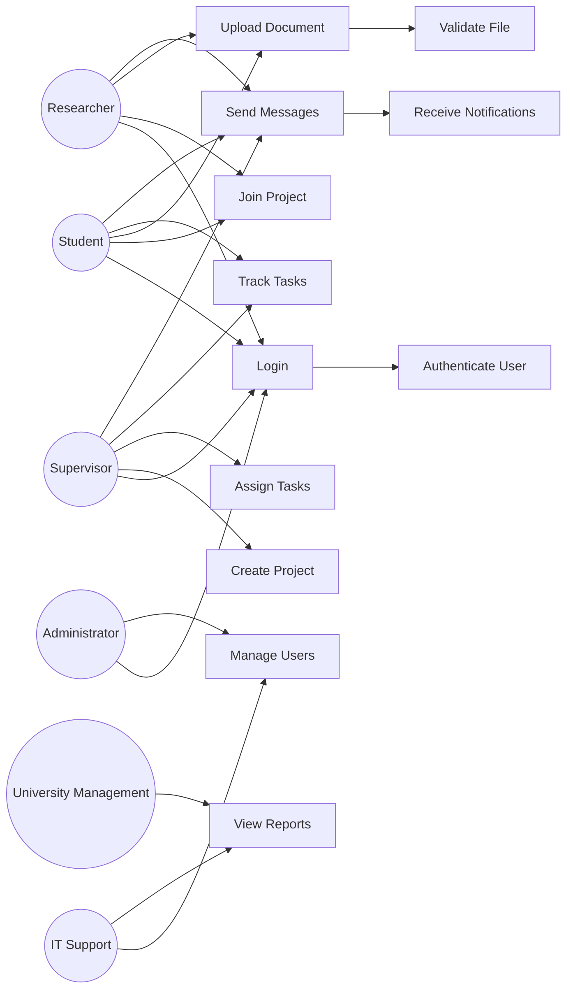

# Use Case Modeling

## Use Case Diagram (UML with Relationships)

---

## Explanation 

### Actors

The system includes six key actors:

* Students, Supervisors, and Researchers (primary users)
* Administrator and IT Staff (system management)
* University Management (strategic oversight)

### Use Case Relationships

* **<<include>> relationships (implicit in diagram):**

  * Login includes *Authenticate User*
  * Upload Document includes *Validate File*
  * Send Messages includes *Receive Notifications*

* **Why important:**
  These show **reusable system behavior**, improving modularity.

* **System Thinking:**
  This demonstrates separation of concerns:

  * Authentication handled independently
  * File validation abstracted from upload logic

### Stakeholder Alignment

| Stakeholder | Addressed Use Case                         |
| ----------- | ------------------------------------------ |
| Students    | Join Project, Upload Document, Track Tasks |
| Supervisors | Create Project, Assign Tasks               |
| Researchers | Manage Documents                           |
| Admin       | Manage Users                               |
| IT Staff    | System Monitoring                          |
| Management  | View Reports                               |

# Detailed Use Case Specifications (Enhanced)

---

## UC1: Login

* **Actor:** All Users
* **Description:** Authenticates users into the system
* **Preconditions:** User is registered
* **Postconditions:** Secure session established

### Basic Flow:

1. User enters credentials
2. System validates credentials
3. Session is created

### Alternative Flows:

* Invalid credentials → error message
* System unavailable → retry later

### Business Rule:

* Password must be encrypted

---

## UC2: Upload Document (Critical Use Case)

* **Actor:** Student / Researcher
* **Preconditions:** Logged in, project exists
* **Postconditions:** Document stored with version

### Basic Flow:

1. User selects file
2. System validates file (type, size)
3. File uploaded
4. Version recorded

### Alternative Flows:

* Invalid file type → reject
* File too large → reject
* Upload failure → retry

### Includes:

* Validate File

---

## UC3: Assign Task

* **Actor:** Supervisor
* **Preconditions:** Project exists
* **Postconditions:** Task created

### Basic Flow:

1. Supervisor creates task
2. Assigns user
3. Sets deadline
4. System saves

### Alternative Flow:

* Invalid deadline → error

---

## UC4: Track Task

* **Actor:** Student / Supervisor
* **Preconditions:** Tasks exist
* **Postconditions:** Status updated

---

## UC5: Send Message

* **Actor:** All Users
* **Postconditions:** Message delivered

### Includes:

* Receive Notification

---

## UC6: Create Project

* **Actor:** Supervisor
* **Postconditions:** Project created

---

## UC7: Join Project

* **Actor:** Student / Researcher
* **Postconditions:** User added

---

## UC8: Manage Users

* **Actor:** Admin
* **Postconditions:** Users updated

